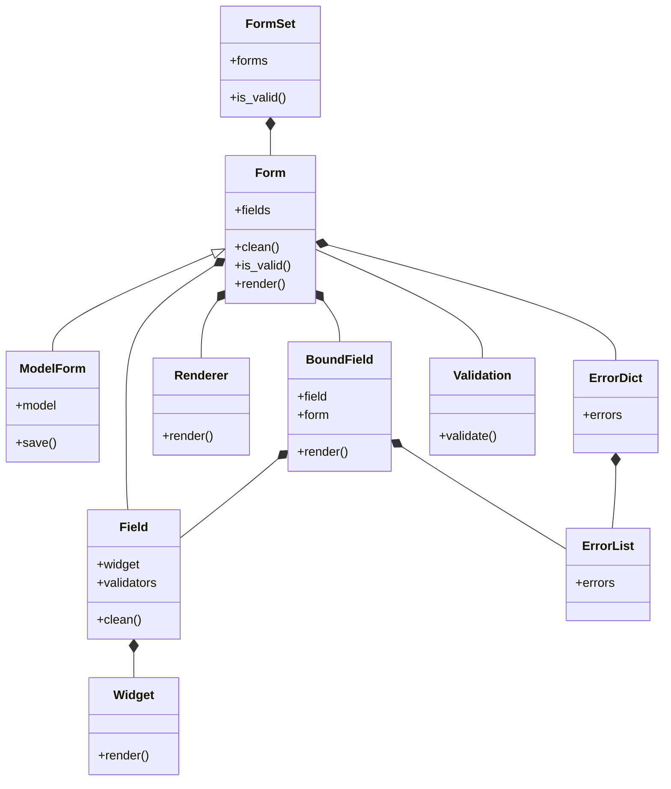


<!-- markdownlint-disable MD025 MD033 -->
<!-- .slide: class="title blue" -->

# What are forms? 📋

(in Django) <!-- .element class="fragment" role="doc-subtitle" -->

---

## `<form>`

---

## `django.forms.Form`

---

### Validation

### Presentation

---

<dl>
  <dt>
    <code>Form</code>/<code>ModelForm</code>
  </dt>
  <dt>
    <code>Field</code>
  </dt>
  <dt>
    <code>Widget</code>
  </dt>
  <dt>
    <code>BoundField</code>
  </dt>
</dl>

---

---

<figure>
  
  <figcaption>
    Charlie Day as Charlie in <i>It's Always Sunny in Philadephia</i>, "Sweet Dee Has a Heart Attack"1
  </figcaption>
</figure>

<cite class="footnote">
  1. <a href="https://knowyourmeme.com/memes/pepe-silvia">Pepe Silvia | Know Your Meme - https://knowyourmeme.com/memes/pepe-silvia</a>
</cite>

---

<iframe src="/talks/dcus2024/level1/"></iframe>

---

<iframe src="/talks/dcus2024/date/"></iframe>

---

  

    ???
  

  

    ???
  

  

    ???
  

  

    ???
  

  

---

## Use the platform

---

  

    Use the platform
  

  

    ???
  

  

    ???
  

  

    ???
  

  

---

## `field.as_field_group`

---

  

    Use the platform
  

  

    <code>
      field.as_field_group
    </code>
  

  

    ???
  

  

    ???
  

  

---

<!--- .slide: class="title orange" -->
# Let's build! 👷💪

---

<!--- .slide: class="bg-orange-600 text-orange-50" -->
## Scenario

---

<h3>Choose your PM</h3>

  <button type="button" class="flex flex-col items-center justify-center border-green-500 border-2 shadow-lg bg-green-500/10 hover:bg-green-500/75 rounded-lg" @click="clickCount++">
    
    = 10 && clickCount < 20"/>
    = 20 && clickCount < 30"/>
    
Guinan

  </button>
  <button type="button" class="flex flex-col items-center justify-center border-red-500 border-2 shadow-lg bg-red-500/10 hover:bg-red-500/75 rounded-md" @click="Reveal.right()">
    
    = 10 && clickCount < 20"/>
    = 20 && clickCount < 30"/>
    
Q

  </button>
  

    Click count: 
  

  <template x-if="clickCount > 1">
    

      

        
Captain Jean-Luc Picard

        
USS Enterprise

      

      
      <audio src="" loop autoplay></audio>
    

  </template>

---

<iframe src="/talks/dcus2024/password-reset/"></iframe>
